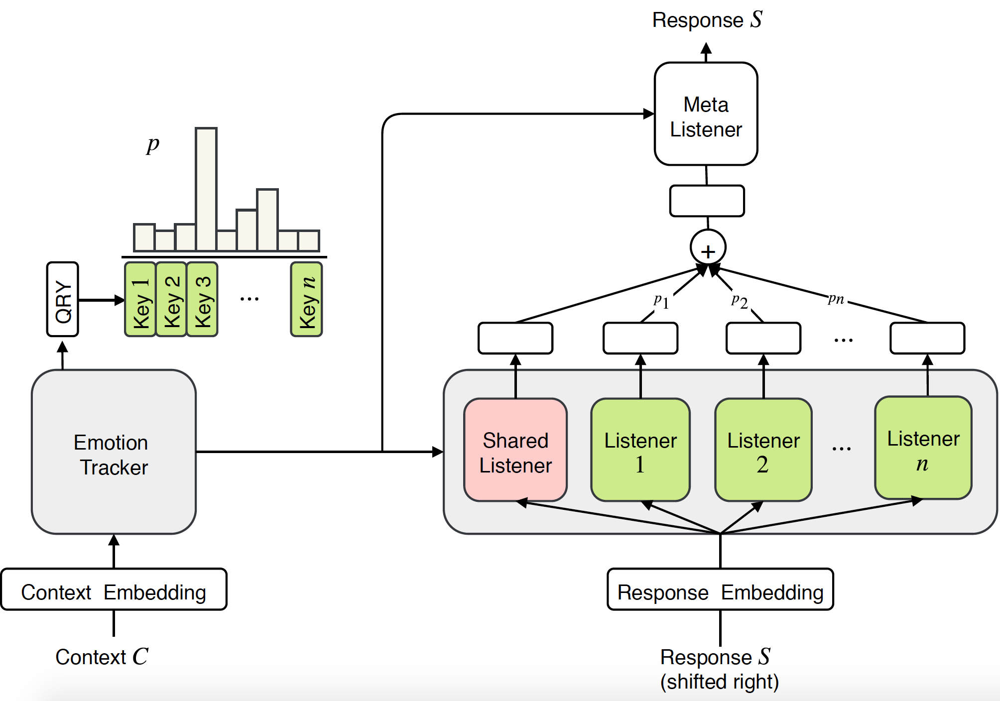
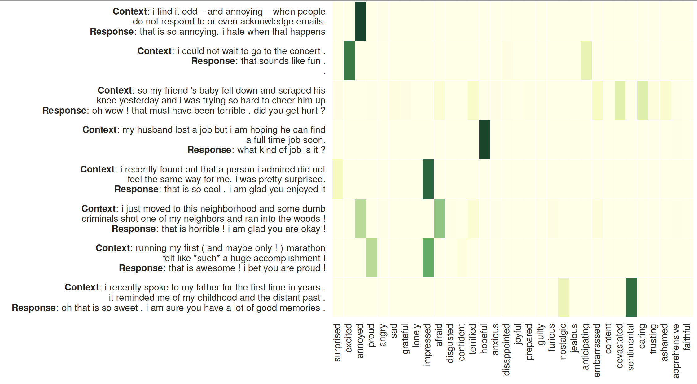

## MoEL: Mixture of Empathetic Listeners
 [](https://opensource.org/licenses/MIT) 


This is the PyTorch implementation of the paper:

**MoEL: Mixture of Empathetic Listeners**. [**Zhaojiang Lin**](https://zlinao.github.io/), Andrea Madotto, Jamin Shin, Peng Xu, Pascale Fung  ***EMNLP 2019*** [[PDF]](https://arxiv.org/pdf/1908.07687.pdf)

This code has been written using PyTorch >= 0.4.1. If you use any source codes or datasets included in this toolkit in your work, please cite the following paper. The bibtex is listed below:
<pre>
@article{lin2019moel,
  title={MoEL: Mixture of Empathetic Listeners},
  author={Lin, Zhaojiang and Madotto, Andrea and Shin, Jamin and Xu, Peng and Fung, Pascale},
  journal={arXiv preprint arXiv:1908.07687},
  year={2019}
}
</pre>

## Abstract
Previous research on empathetic dialogue systems has mostly focused on generating responses given certain emotions. However, being empathetic not only requires the ability of generating emotional responses, but more importantly, requires the understanding of user emotions and replying appropriately. In this paper, we propose a novel end-to-end approach for modeling empathy in dialogue systems: Mixture of Empathetic Listeners (MoEL). Our model first captures the user emotions and outputs an emotion distribution. Based on this, MoEL will softly combine the output states of the appropriate Listener(s), which are each optimized to react to certain emotions, and generate an empathetic response. Human evaluations on empathetic-dialogues dataset confirm that MoEL outperforms multitask training baseline in terms of empathy, relevance, and fluency. Furthermore, the case study on generated responses of different Listeners shows high interpretability of our model.

## MoEL Architecture:
<p align="center">

</p>
The proposed model Mixture of Empathetic Listeners, which has an emotion tracker, n empathetic listeners along with a shared listener, and a meta listener to fuse the information from listeners and produce the empathetic response.

## Attention on the Listeners

<p align="center">

</p>

The visualization of attention on the listeners: The left side is the context followed by the responses generated by MoEL. The heat map illustrate the attention weights on 32 listeners


## Dependency
Check the packages needed or simply run the command
```console
❱❱❱ pip install -r requirements.txt
```
[**Pre-trained glove embedding**](http://nlp.stanford.edu/data/glove.6B.zip): ***glove.6B.300d.txt*** inside folder /vectors/.


## Experiment
***Quick Result***

To skip training, please check ***generation_result.txt***.

***Dataset***

The dataset (empathetic-dialogue) is preprocessed and stored in npy format: sys_dialog_texts.train.npy, sys_target_texts.train.npy, sys_emotion_texts.train.npy which consist of ***parallel*** list of context (source), response (target) and emotion label (additional label). 

***Training&Test***

MoEL
```console
❱❱❱ python3 main.py --model experts  --label_smoothing --noam --emb_dim 300 --hidden_dim 300 --hop 1 --heads 2 --topk 5 --cuda --pretrain_emb --softmax --basic_learner --schedule 10000 --save_path save/moel/

```
Transformer baseline
```console
❱❱❱ python3 main.py --model trs  --label_smoothing --noam --emb_dim 300 --hidden_dim 300 --hop 2 --heads 2 --cuda --pretrain_emb --save_path save/trs/

```
Multitask Transformer baseline
```console
❱❱❱ python3 main.py --model trs  --label_smoothing --noam --emb_dim 300 --hidden_dim 300 --hop 2 --heads 2 --cuda --pretrain_emb --multitask --save_path save/multi-trs/

```
